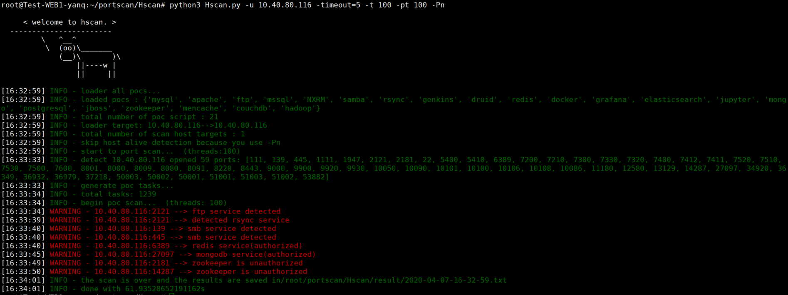

# Hscan

主机漏洞扫描器

目前已集成如下poc
```
'postgresql', 'ftp', 'mongo', 'redis', 'elasticsearch', 
'couchdb', 'docker', 'grafana', 'jupyter', 'jboss', 'druid', 
'hadoop', 'genkins', 'mencache', 'zookeeper', 'mysql', 
'apache', 'samba', 'rsync', 'mssql', 'NXRM'
```

参数说明
```
(所有的命令行参数都可在config.conf文件中指定)

# 1. 指定扫描目标(必需有以下其中之一)
-u 10.10.10.10 指定单个目标
-f ips.txt 从文件中加载目标

# 2. 指定需要扫描的端口(默认为全端口)
-p 1-1000,6379,27017 命令行指定扫描的端口

# 3. 其他
-Pn 不做存活探测，认为其全为存活
-Ps 不做端口开放扫描，认为其全为开放状态
-pt 开放端口扫描的并发数，默认为200
-t  poc漏洞扫描的并发数，默认为200
-timeout 扫描超时时间
-vv 输出更详细的信息
```

